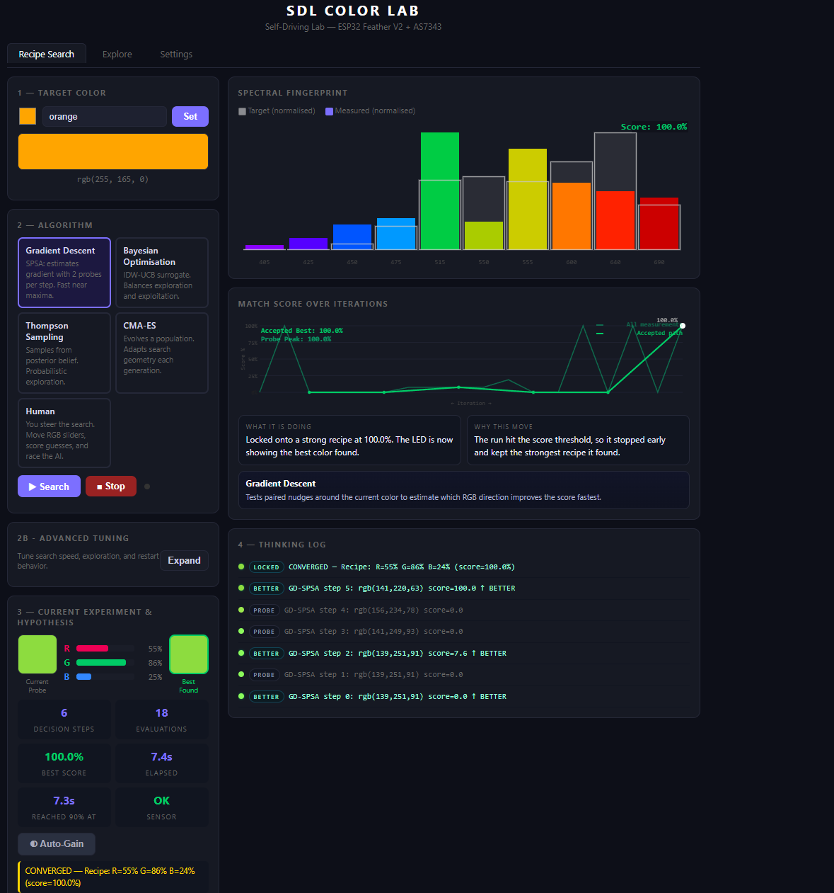
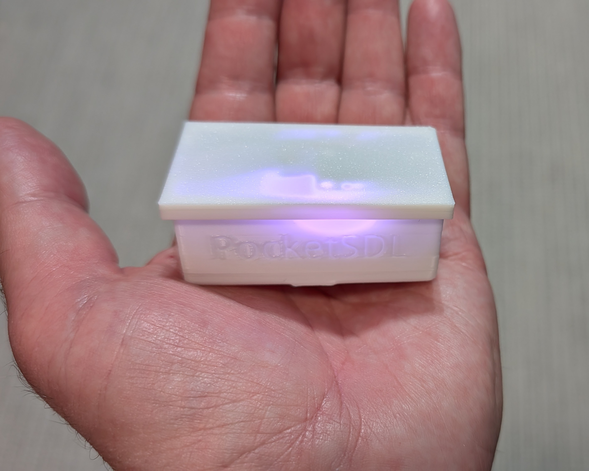
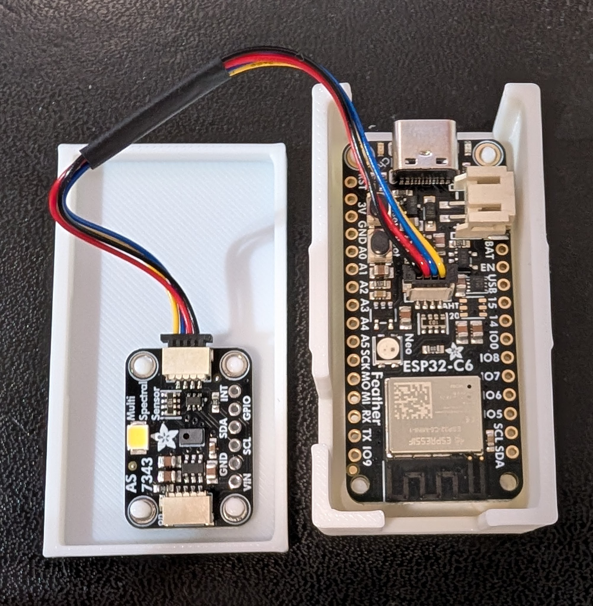
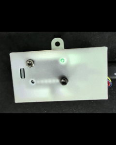

This is a minimal self-driving lab demonstration to "discover" color theory by doing an exploration/exploitation search of color space through driving a RGB LED and measuring it with a 14-channel color sensor. Users (often students) will learn about different SDL algorithms, such as Baysean Optimization and Gradient Descent, understanding why some are better at the task than others, and be able to try to beat the AI with "Human" mode. It all works via a web UI, but involves real-world data, where you can watch the experiments running in real time.

The whole thing can be made for $40, with no soldering required. it has an optional 400mah LiPo battery that the Feather can automatically recharge, making this a totally self-contained and portable SDL.

Instructions: Load code onto ESP32 with the Platormio extension in VSCode (change the port in the ini file to whatever your ESP32 shows up as). Codex or Claude Code extensions in VS Code will do this for you. Alternatively, you can just load the file on the ESP32 using the Arduino IDE.

3D print the two parts: [base](base.stl) and [cover](cover.stl). Everything is snap-together, no screws required.

If you haven't set your wifi details in the code, on startup after 30 seconds it will create its own Wifi access point called "SDL". Connect your phone or laptop to it and when prompted to login via a brower it will automatically take you to the app. Once in the app, in the setting tab you can search for your local Wifi network and enter in your password (if any) and press "Connect" (you only need to do this once; it will remember it next time). Once it's connected to your network, you should be able to open the UI in your web browser by just typing "sdl.local" in the URL bar. 

When plugged in via USB, the Feather will automatically charge the Lipo, if you're using one.

----

BOM:
- [Adafruit Feather ESP32 C6](https://www.adafruit.com/product/5933) ($14.95)
- [Adafruit 10-channel color sensor](https://www.adafruit.com/product/4698) ($18.95)
- [Adafruit Stemma 4-pin cable, 50mm](https://www.adafruit.com/product/4399)  ($0.95, if out of stock, a longer cable can work, too)
- Optional [Adafruit 400mAh battery with short cable](https://www.adafruit.com/product/3898) ($6.95)

